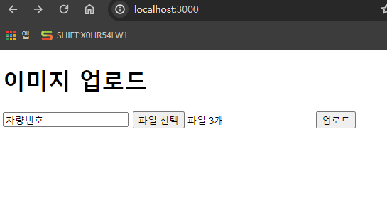
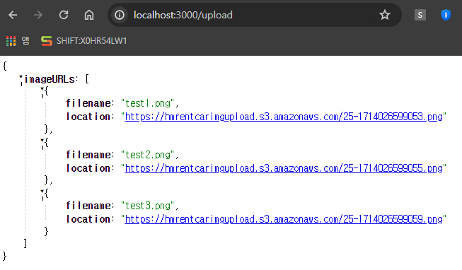
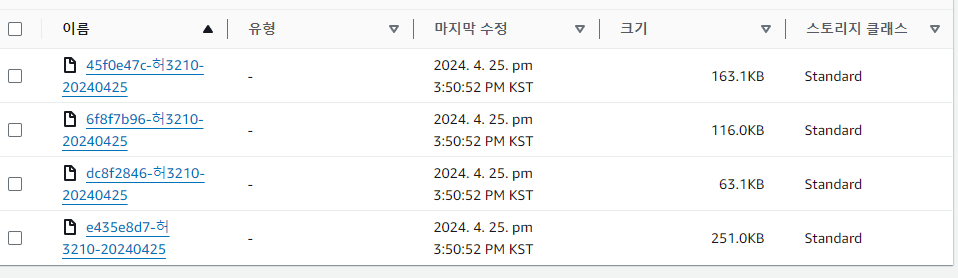

 # (해결). 이미지 다중 업로드시 데이터 유실 발생
## => message queue를 이용해서 순차적으로 전송하는 방식을 시도중 => 이미지파일을 배열에 담은 이후, sqs로한번에 보내는 방식으로 다시 시도중

# 1-1. 이미지 파일의 파일명이 깨져서 나오는 현상 => 해결하는김에 원하는 디렉토리 형식으로 파일명을 저장시도중. 
## ('차량번호'_'YYYY/MM/DD'_'uuid') 형식으로 저장하여, 차량번호 + 날자 단위로 조회하거나 sort 할 수 있도록

# 2. 게시글 형식/ 채팅방 형식 고민중.
## 유저 편의성 면에서 채팅방이 익숙하겠으나, confirm 표시를하고 목록을 listing하는데에 게시판 형식이 더 적절할 것으로 보임
## 컨펌되지 않은 게시글이 상단으로, 게시된 시간 순서대로, "긴급" 표시를 추가한다면, "일반" 게시글보다 상단에 위치, 하이라이트

# 3. Authority
## 결제 승인자는 결제를하고 결재 커멘트를 추가할 수 있도록
## 보고자는 게시글을 올릴 수 있지만, 수정/삭제에는 승인자의 허가가 필요하도록 (10분 이내로 수정시 승인이 필요 없도록 구현)

# 4. ERP 연동
## authority를 설정함에 있어 일부 이미 필요한 부분이지만, ERP의 db 연동이 최우선 목표. 유저 정보와, bucket에 저장된 이미지 데이터를 가져온다. (게시글과 승인여부, 수정허가여부등의 데이터는 추가테이블에 담을 것)
## DB 뿐만 아니라, ERP를 직접 '조회'만 가능하도록 일부 페이지/버튼의 기능을 Tomcat으로 빼내어 웹상에서 조작이 가능하도록 설정한다. (권한은 VPN 설정으로 or 로그인에서 권한 부여를 해도 보안상 안전할지 검토필요)

# 5. (OPTIONAL) 이미지의 metadata 검수
## 이미지파일이 아닌 파일은 업로드를 제한하도록 설정.

# 6. 프론트 입히기
## bootstrap으로 대략적인 디자인 입히기, 업로드된 파일/ 업로드 진행도 시각화 / 반응형 UI / 게시판 페이지네이션 적용

# 7. 전송 실패시 실패한 파일만 재전송 시도
## t/o 을 걸어서 자동으로 일정시간동안 업로드가 완료되지 않은 컨텐츠는 재 업로드를 하도록 설정
## 재전송 시도 횟수를 걸어놓고, 일정횟수가 넘어가면 일시정지하도록 설정. 일시정지된 전송 메세지는 수동으로 재전송 시도 가능
## 모든 컨텐츠가 전송되지 않은 시점에서 '게시글'이 올라가게 해야하는지, 아니면 모든 이미지파일이 전송되었을때만! 게시글이 등록되도록 해야하는지. 또는 사용자에게 선택권을 줘야하는지.
## 모든 컨텐츠가 전송되지 않은 시점에서 '게시글'이 올라가게 설정한다면, 수정 권한에 대해서도 고민해봐야함. (일반적으로 수정은 불가능하지만 webapp을 통해 재전송 된 데이터는 받아서 추가하도록 해줘야하는지?)
## 사용자에게 선택권을 주고, 수정이 불가하다는 alert를 달아주면 일단 해결되긴 할 듯. 

# 7-1. 인터넷 상태 등을 이유로 전송이 되지 않은 경우, 전송이 잘 되지 않았음을 나타내주는 무언가가 필요할 것.
## S3 bucket에 모든 데이터가 전달되고 나면, tcp/ip 통신형태처럼 돌려받는 값이 있는지?
## 있다면 => 값을 돌려받지 못한 파일에 대하여 재전송 요청을 하거나
## 없다면 => 이미지가 업로드 된 이후 검수하는 어떤 과정이 필요할 것.

# 랜딩페이지

### 차량번호를 입력하고, 파일을 선택한 이후에, 업로드 버튼을 누르면, bucket에 이미지 파일 이 저장됨

### 저장된 이미지 파일 리스트는 key-value값으로 출력되고, 해당창은 미리보기  창 등으로 리턴 예정
### shortuuid-차량번호-YYYYMMDD 값으로 저장.

### 업로드 된 이미지는, 직후 미리보기로 출력 (정돈및 css 적용은 사이즈만 적용되어있음)

* 아직 언제든 설계가 뒤집힐 수 있으므로, 리팩토링 및 구조설계는 기본 동작들을 완성하고 진행
마지막 수정 : 2024-04-25
